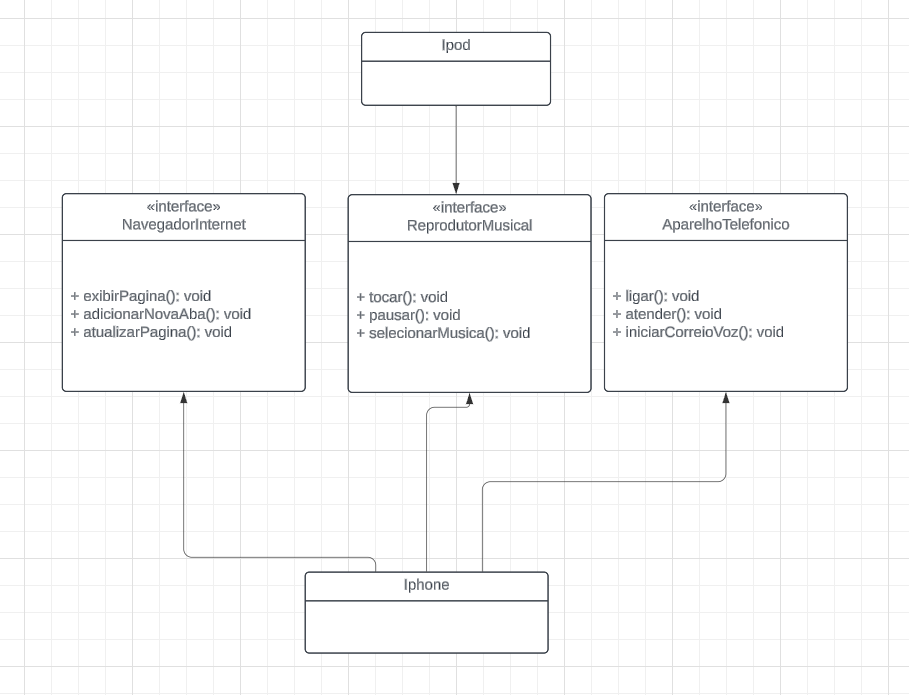

## O que é o projeto?

O projeto faz parte de um case da Instituição de ensio DIO juntamente com a empresa GFT em que participei.

O projeto tem os seguintes requisitos:

Elaborar em uma ferramenta **UML** a diagramação das classes e interfaces com a proposta de apresentar os papéis do Iphone de :
- [x] Reprodutor Musical
- [x] Aparelho Telefônico
- [x] Navegador Internet

Criar classes e interfaces no formato de arquivos **.java**:
- [x] NavegadorInternet.java // *interface*
- [x] ReprodutorMusical.java // *interface*
- [x] AparelhoTelefonico.java // *interface*
- [x] Iphone.java // *class*
- [x] Ipod.java // *class* - representação aparelho externo
- [x] Usuario.java // *class*

Funcionalidades adicionais:
- [x] Apresentar a funcionalidade no iphone e no ipod.

Pré-requisitos:

1. Lógica de programação e POO;
2. Conhecimentos básicos (JAVA);
3. Computador com SO de sua preferência(Windows, Linux, Mac OS);
4. IDE (visual studio code, eclipse, Intellij;

Criação do UML:

Foi feita a  criação do diagrama UML pela plataforma online Lucid.app.
Clique para acessar: [Lucid.app](https://lucid.app/lucidchart/b0f6c26a-0215-4dea-ac60-4afda2fa296c/edit?viewport_loc=1629%2C243%2C2455%2C1162%2CHWEp-vi-RSFO&invitationId=inv_205293ba-fd65-45d0-8de4-ed67d15b9625)

